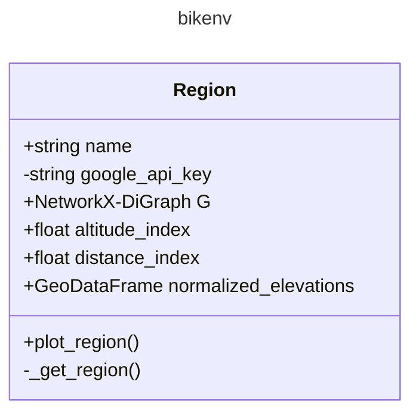

# Structure of the package

`class` **Region**

- Attributes
    - `name`
    - `google_api_key`
    - `G`
    - `altitude_index`
    - `distance_index`
    - `normalized_elevations`
- Methods
    - `_get_region()`

